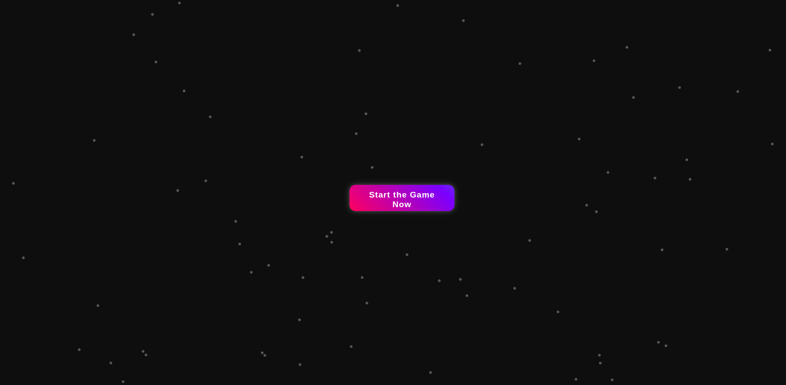

<h1 align="center" style="font-size: 3rem;">⚡ Neon XO ⚡</h1>

<p align="center">
  
</p>

---

## 🎮 About The Game  

🔥 **Neon XO** is a futuristic, gamified version of the classic Tic-Tac-Toe experience, reimagined with animated **neon gradients**, **sound effects**, and a **dark mode switcher** for immersive play.  
Built for browsers, powered by vanilla **HTML**, **CSS**, and **JavaScript** — no frameworks, no dependencies, pure web magic.  

---

## ✨ Features  

- 🌙 **Dark / Light Mode Toggle**
- 🎨 Glowing **Neon UI** with animated buttons
- 🎶 **Sound Effects** on every move and victory
- 🎮 Modern, interactive 3x3 grid layout
- 📱 Responsive and mobile-friendly
- ⚡ Zero libraries — 100% pure web technologies  

---

## 🌟 Demo  

👉 [**Play Neon XO Live**](https://neon-xo.vercel.app/) 

---

## 📸 Preview  

<p align="center">
   Start_page
  
  
  
  
  
</p>

---

## 🚀 How To Play  

1. Click **Start Game**  
2. Choose your move: `X` or `O`  
3. First player to align 3 marks (row, column, diagonal) wins  
4. Toggle 🌙 / ☀️ for your preferred theme  
5. Hit **Reset** to play again  

---

## 🖥️ Tech Stack  

- 🔹 HTML5  
- 🔹 CSS3 (with animated gradients, conic backgrounds, hover pulses)  
- 🔹 JavaScript (DOM manipulation + event handling)  

---

## 📂 Project Structure  

```bash
Neon-XO/
├── index.html
├── style.css
├── script.js
└── README.md
```

---

## 💾 Installation & Run Locally  

```bash
# Clone the repository  
git clone https://github.com/yourusername/Neon-XO.git  

# Navigate to project directory  
cd Neon-XO  

# Open with your browser  
open index.html
```

_or just double-click on `index.html` file in your file explorer._

---

## 📦 Deployment  

Easily deploy your game to the web with:
- **GitHub Pages**
- **Netlify**
- **Vercel**

Example for GitHub Pages:
1. Push your project to a GitHub repo
2. Go to **Settings → Pages**
3. Select branch `main` (or `master`) and `/root` directory
4. Click **Save** — your site goes live 🎉  

---

## 📜 License  

This project is licensed under the **MIT License** — feel free to use, modify, and share with credit.  
---

## 📣 Connect With Me  

[](https://github.com/Jeevanreddy-2005)  
[](https://www.linkedin.com/in/yourusername)  

---
⚡ Made with 💖 and Neon Lights by Jeevan N
